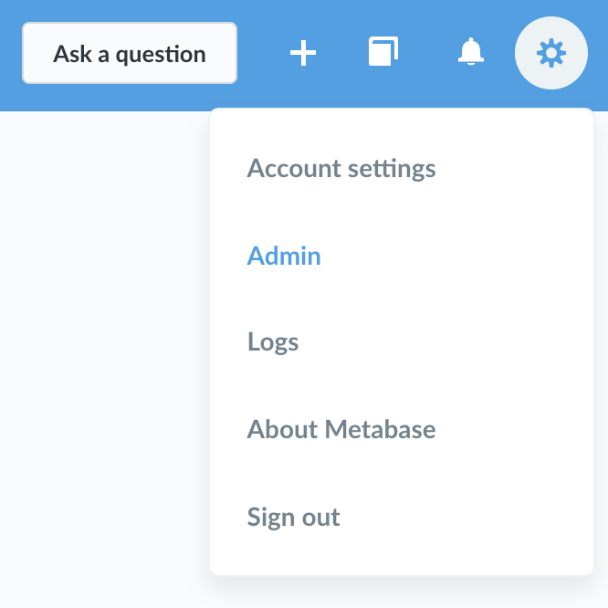

## Managing Databases
If you already connected your database during the installation, you’ve probably a covered a lot of this info. But if you need to add another database or manage the settings of the one you already have connected, just click the circle with your initials in the top right of Metabase and select the **Admin Panel**.

Cool, now you’re in the admin panel. Next, select **Databases** from the menu bar at the top of the screen to see your databases.

### Adding a Database Connection

Now you’ll see a list of your databases. To connect another database to Metabase, click **Add database**. Metabase currently supports the following types of databases: 

* H2
* MongoDB
* MySQL
* Postgres

To add a database, you'll need its connection information.  The [Installation Guide](installation-guide.md) explains where to find your database's connection information.  

### Secure Socket Layer (SSL)

Metabase automatically tries to connect to databases with and without SSL. If it is possible to connect to your database with a SSL connection, Metabase make that the default setting for your database. You can always change this setting later if you prefer to connect without this layer of security, but we highly recommend keeping SSL turned on to keep your data secure.

### Database Analysis

When Metabase connects to your database, it tries to decipher the field types in your tables based on each field's name. Metabase also takes a sample of each table to look for URL's, json, encoded strings, etc. If a field is classified wrong, you can always manually edit it from the **Metadata** tab in the Admin Panel.

### Metadata Syncing

Metabase automatically syncs its copy of your database with the original database source every night, but if you'd like to sync your database manually at any time:

1. Go to the Admin Panel.

2. Select **Databases** from the navigation menu.  

3. Click on the database you would like to sync. 

 
4. Click on the **Sync** button on the right of the screen.

### Deleting Databases

To delete a database from Metabase, click on **Remove this database** from the database detail screen.

You can also delete a database from the database list: hover over the row with the database you want to remove and click the **Delete** button that appears.  

**Caution: Deleting a database is irreversible!  All saved questions and dashboard cards based on the database will be deleted as well!**

---
## Next: enabling features that send email
Metabase can send emails for certain features, like email invites, but first you need to [set up an email account](02-setting-up-email.md).
