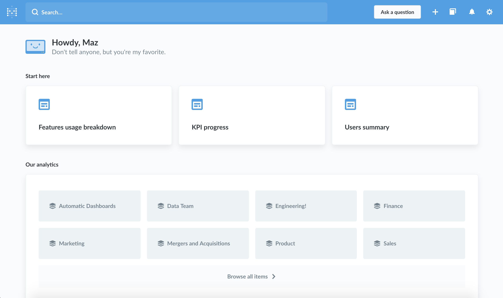
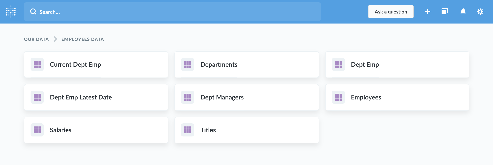
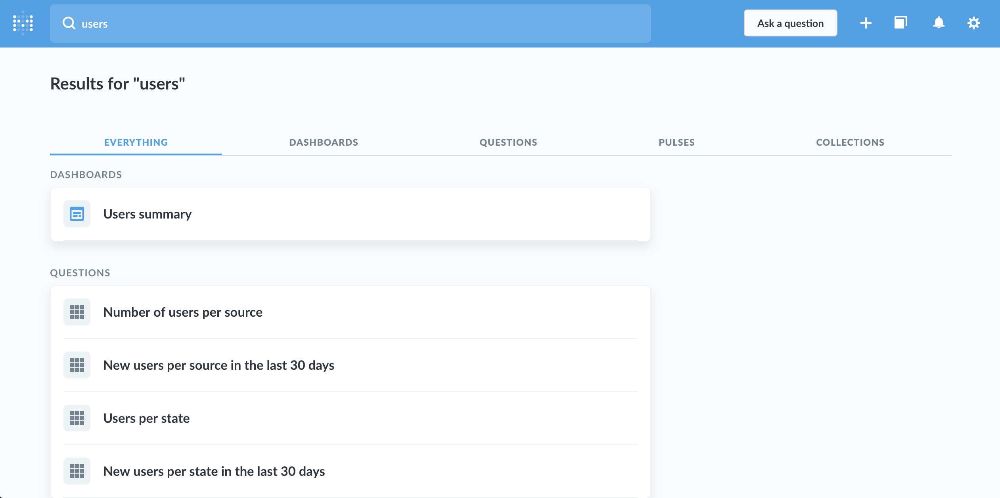

## What is Metabase?

Metabase is an open source business intelligence tool. It lets you ask questions about your data, and displays answers in formats that make sense, whether that's a bar graph or a detailed table.

Your questions can be saved for later, making it easy to come back to them, or you can group questions into great looking dashboards. Metabase also makes it easy to share questions and dashboards with the rest of your team.

## Finding your way around

So, you've [gotten Metabase up and running](../operations-guide/start.md) and [connected it to your data](../administration-guide/01-managing-databases.md). It's time to give you the lay of the land.

### The home page

Fresh out of the box, Metabase will show you a few things on the home page:
* Some [automatic explorations](14-x-rays.md) of your tables that you can look at and save as a dashboard if you like any of them.
* An area where things you or your teammates create will show up, along with a link to see all the dashboards, questions, and pulses you have.
* A list of the databases you've connected to Metabase.

Once you've created some [dashboards](07-dashboards.md), any of them that you pin will show up on the homepage for all of your teammates, so that when they log in to Metabase they'll know right where to go.

### Browse your data

If you connected your database to Metabase during setup, you'll see it listed at the bottom of the homepage along with the sample dataset that Metabase comes with. Click on a database to see its contents. You can click on a table to see its rows, or you can also click on the bolt icon to x-ray a table and see an automatic exploration of it, or click on the book icon to go to the data reference view for that table to learn more about it.

### Explore your analytics

As long as you're not the first Metabase user on your team, you can browse the dashboards, questions, and collections your teammates have made. [More about exploring](03-basic-exploration.md)

### Ask a question or write a query

Click the `Ask a question button` to start a new custom exploration of one of your tables or to write a new SQL or native query if you want to really dig in.

### Make a new dashboard or pulse

In Metabase, dashboards are made up of saved questions that you can arrange and resize as you please. They're a great way to track important metrics and stats that you care about. Pulses are what regularly scheduled reports are called in Metabase. They can be sent out either via email, Slack, or both.

To make a dashboard or pulse, click the plus (+) icon in the top-right of the main navigation bar.

### Use search to quickly find things

The search bar that's always present at the top of the screen lets you search through your dashboards, collections, saved questions, and pulses in an instant. Just type part of the title of the thing you're looking for and hit enter.

## A primer on databases

To fully understand how to use Metabase, it’s useful to have at least a high-level understanding of databases, so we'll discuss [the basics of databases](02-database-basics.md) next.
