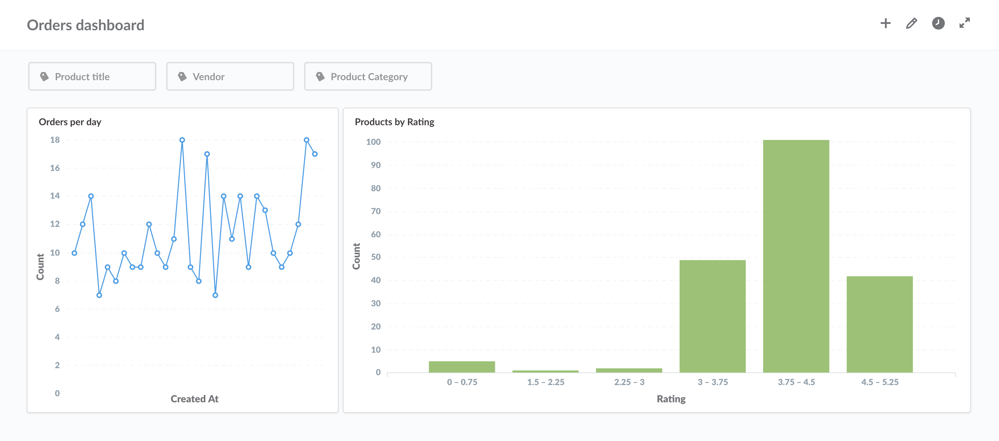
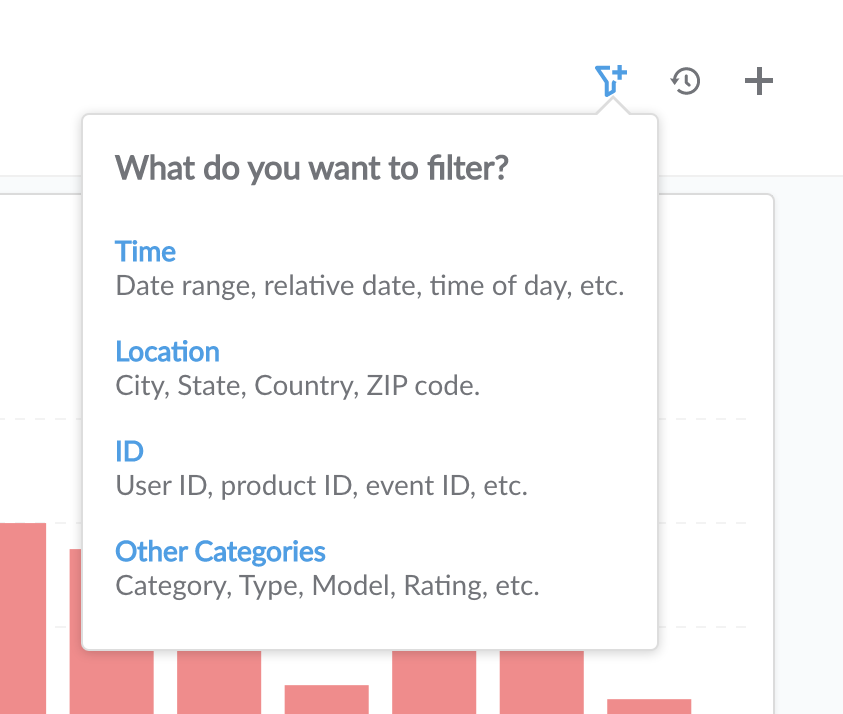
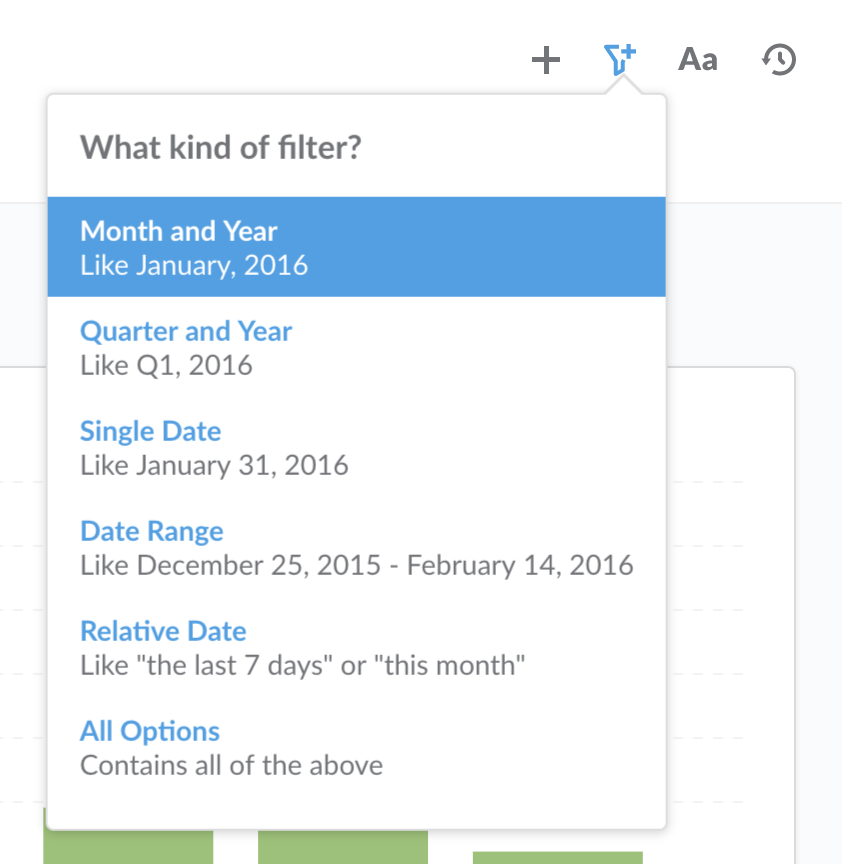
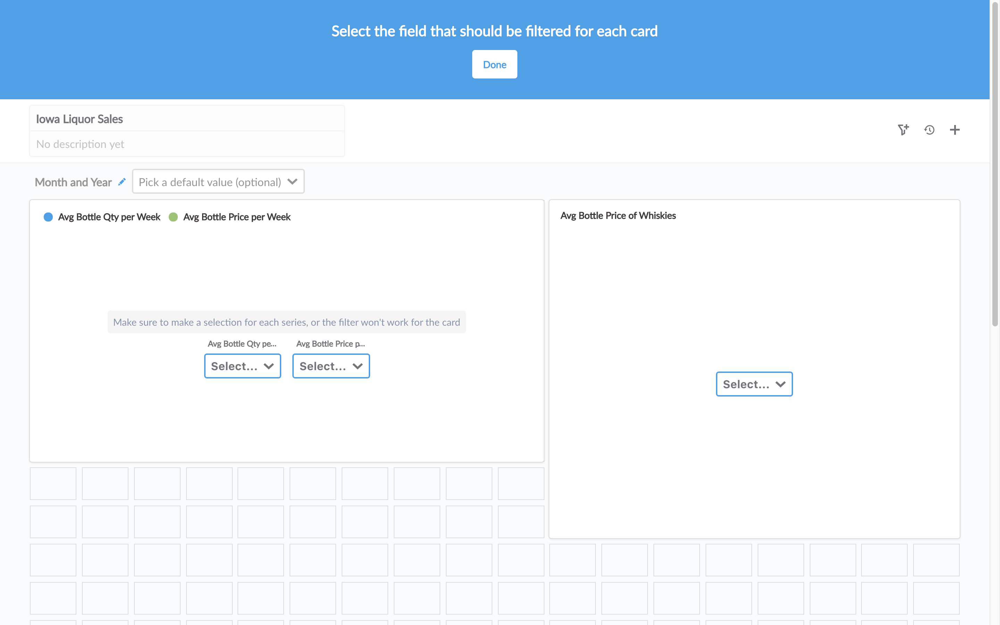
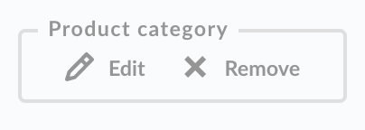
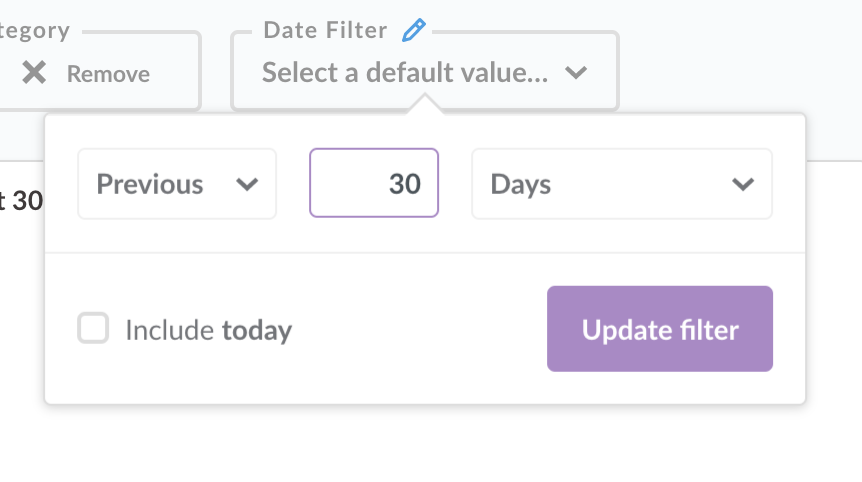
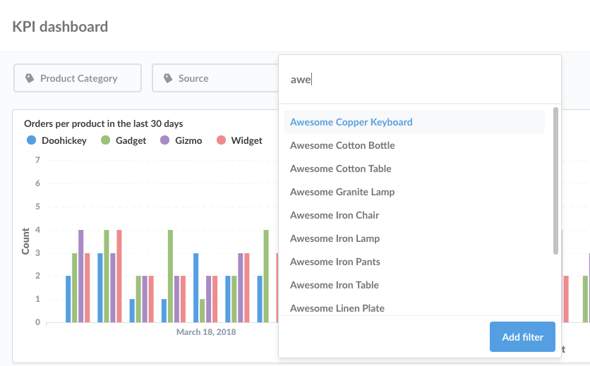
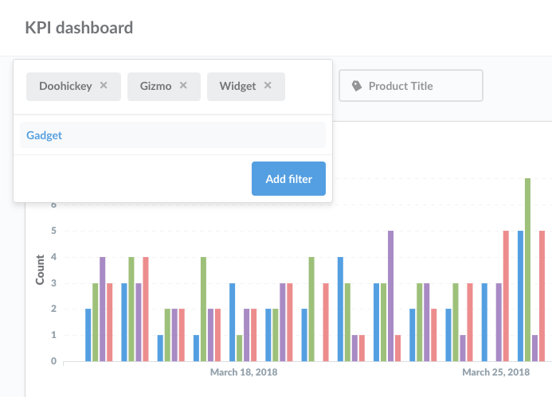
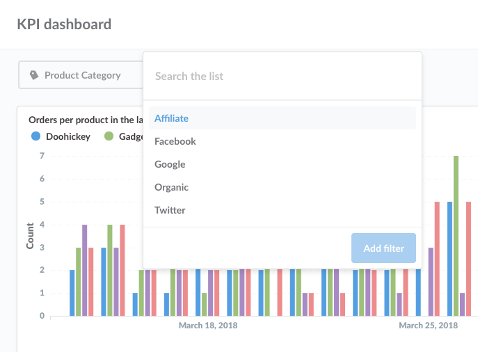

## Dashboard Filters

Have you ever found yourself in a situation where it seems like you need to create nearly identical copies of the same dashboard, with just one different variable? Maybe you have an Earnings dashboard, but you want to see the data for each city your business is in, or maybe you have a KPI dashboard that you want to see broken out by month.

Instead of creating duplicate dashboards, you can use Metabase’s dashboard filters feature to create simple toggles to change a variable for all the cards on a dashboard.

### Adding a new filter

To add a filter to a dashboard, first enter dashboard editing mode, then click the Add a Filter button that appears in the top-right.

You can choose from a number of filter types: Time, Location, ID, or Other Categories. The type of filter you choose will determine what the filter widget will look like, and will also determine what fields you’ll be able to filter your cards by:
* **Time:** when picking a Time filter, you'll also be prompted to pick a specific type of filter widget: Month and Year, Quarter and Year, Single Date, Date Range, Relative Date, or All Options. "Single Date" and "Date Range" will provide a calendar widget, while the other options all provide slightly different dropdown interfaces for picking values. Choose "All Options" to get a widget that's just like the time filter in the graphical query builder.
* **Location:** there are four types of Location filters to choose from: City, State, ZIP or Postal Code, and Country. These will all show up as input box widgets unless the field(s) you're filtering contain fewer than 40 distinct possible values, in which case the widget will be a dropdown.
* **ID:** this filter provides a simple input box where you can type the ID of a user, order, etc.
* **Other Categories:** this is a flexible filter type that will let you create either a dropdown or input box to filter on any category field in your cards. Whether the filter widget is displayed as a dropdown or an input box is dependent on the field(s) you pick to filter on: if there are fewer than 40 distinct possible values for that field, you'll see a dropdown; otherwise you'll see an input box. (A future version of Metabase will include type-ahead search suggestions for the input box widget.)

For our example, we'll select a Time filter, and then select the Month and Year option.

Now we’ve entered a new mode where we’ll need to wire up each card on our dashboard to our new filter. If there’s a card on your dashboard that you don’t want to use with the filter, or that it doesn’t make sense to use with the filter, that’s okay — it’ll just fade out when you use the filter.

So here’s what we’re doing — when we pick a month and year with our new filter, the filter needs to know which field in the card to filter on. For example, if we have a `Total Orders` card, and each order has a `Date Ordered` as well as a `Date Delivered`, we have to pick which of those fields to filter — do we want to see all the orders *placed* in January, or do we want to see all the orders *delivered* in January? So, for each card on our dashboard, we’ll pick a date field to connect to the filter. If one of your cards says there aren’t any valid fields, that just means that card doesn’t contain any fields that match the kind of filter you chose.

#### Filtering SQL-based cards
**Important:** note that if your dashboard includes saved questions that were created using the SQL/native query editor, you'll need to [add a bit of additional markup to your query](13-sql-parameters.md) to add a "field filter variable" in order to use a dashboard filter with your SQL/native questions.

Before we click the `Done` button at the top of the screen, we can also customize the label of our new filter by clicking on the pencil icon next to it. We’ll type in a new label and hit enter. Now we’ll click `Done`, and then save the changes to our dashboard with the `Save` button.

You can add multiple filters to your dashboard following the same steps. We just recommend that you try to stick to just two or three of them for a single dashboard so you don’t confuse your users.

### Editing a filter

To edit a filter, enter dashboard editing mode, then click the `Edit` button on the filter you want to change. You an also click `Remove` to get rid of a filter. If you do this by accident, just click `Cancel` in the top-right to exit dashboard editing mode without saving your changes.

### Setting a default value

If you want one of your filters to start with a default value when you load the dashboard it’s in, while in filter editing mode just click on the filter to select a value. Click the blue X if you want to remove the default value.

### Using filters

Once you’ve added a filter to your dashboard, just click on it to select a value and activate the filter. To stop filtering, just click the blue X. To change the filter, click anywhere else on it.

### Choosing between a dropdown or autocomplete for your filter

As of Metabase 0.29, we've greatly improved how filtering works with fields that have lots of values. If the field you're using for a filter has more than 100 unique values, you'll now automatically see a search box with autocomplete suggestions.

Fields with fewer than 100 distinct values will have a filterable list of options.

In both cases, you can pick one or multiple selections for your filter.

If Metabase somehow picked the wrong behavior for your field, admins can go to the Data Model section of the admin panel and click on the gear icon by the field in question to manually choose between a list, a search box, or just a plain input box.

### Best practices

Here are a few tips to get the most out of dashboard filters:
- Try to keep the number of filters you add to a dashboard to two or three. This will make it easier for your teammates to quickly and easily understand what options are available to them when viewing your dashboard.
- While you can add dashboard filters to a dashboard that already has a bunch of cards in it, it can be easier to start a new dashboard and think about what filters you intend to add to it, and then make sure that you only put cards in that dashboard that can be used with the filters.

### Some things to keep in mind

- When you activate a dashboard filter, any card that isn’t wired up to the filter will fade out to indicate it’s not being filtered. If you activate more than one filter at the same time, cards will fade out unless they’re wired up to *every* active filter.
- If you have a card with multiple series on it that you want to use with a dashboard filter, then just make sure to select a field to be filtered for each of the series in the card.
- While connecting cards to a filter, you might see a warning message that says, `The values in this field don’t overlap with the values of any other fields you’ve chosen`. For example, maybe you selected the `Type of Pants` field for one card, but the `Types of Boats` field for another card; if you’re using those fields for the same filter, this is problematic because the filter would then give options to the user that wouldn't work for both cards (like, `Chinos, Jeans, Kayak, Slacks, Yacht`). Metabase prefers to prevent such silliness.
- You can’t use a dashboard filter with a field in a question if that field is already being used in the definition of the question. For example, say you have a question called `Orders in January`, which counts all the orders and has a filter on the `Date Order Was Placed` field to only select the orders placed January — you can’t then connect a dashboard filter to the `Orders in January` card through the `Date Order Was Placed` field, because that field is already being used to filter the underlying question's data.

---

## Next: Charts with multiple series
We'll learn how to [create charts with multiple lines, bars, and more](09-multi-series-charting.md) next.
