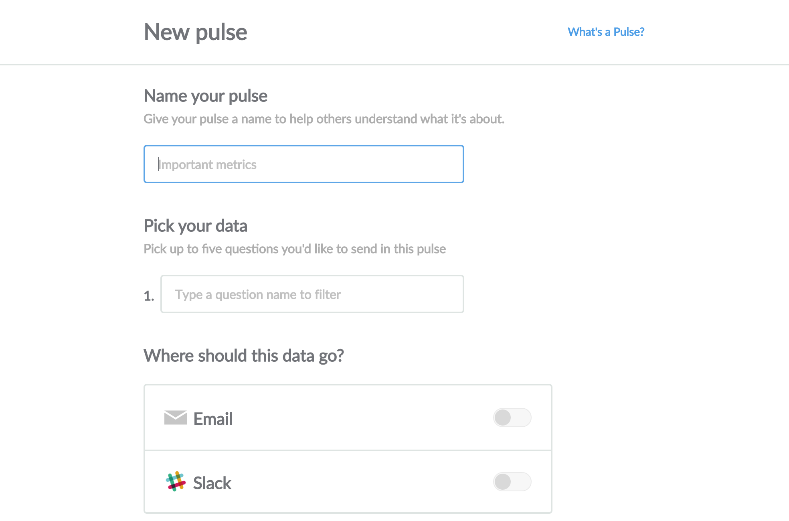
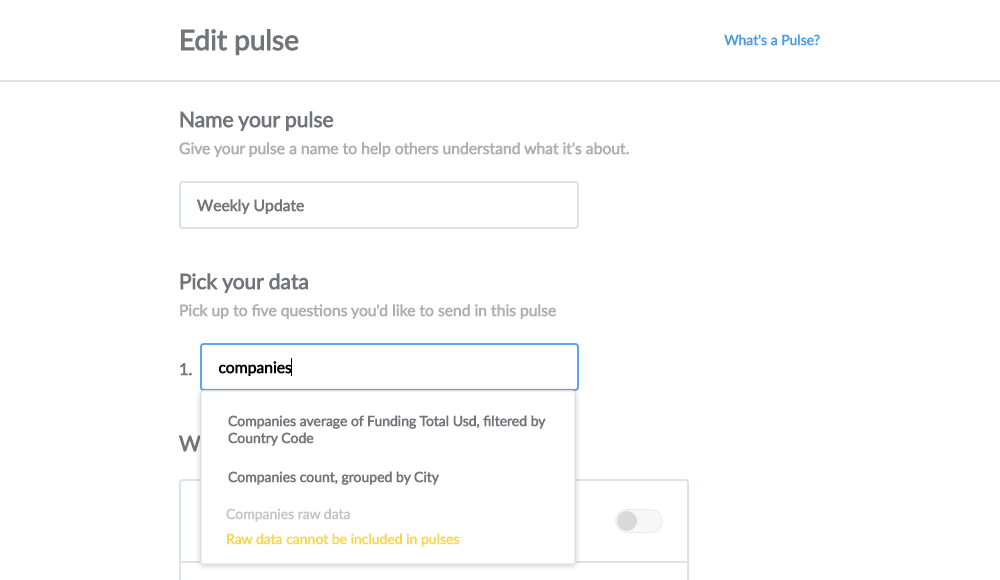
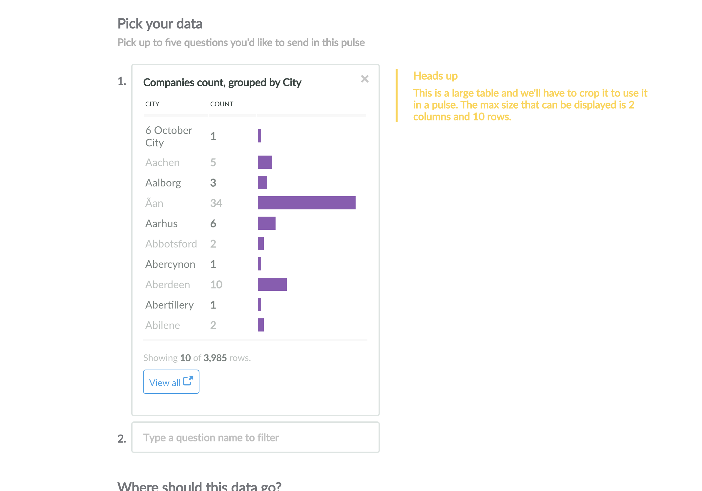
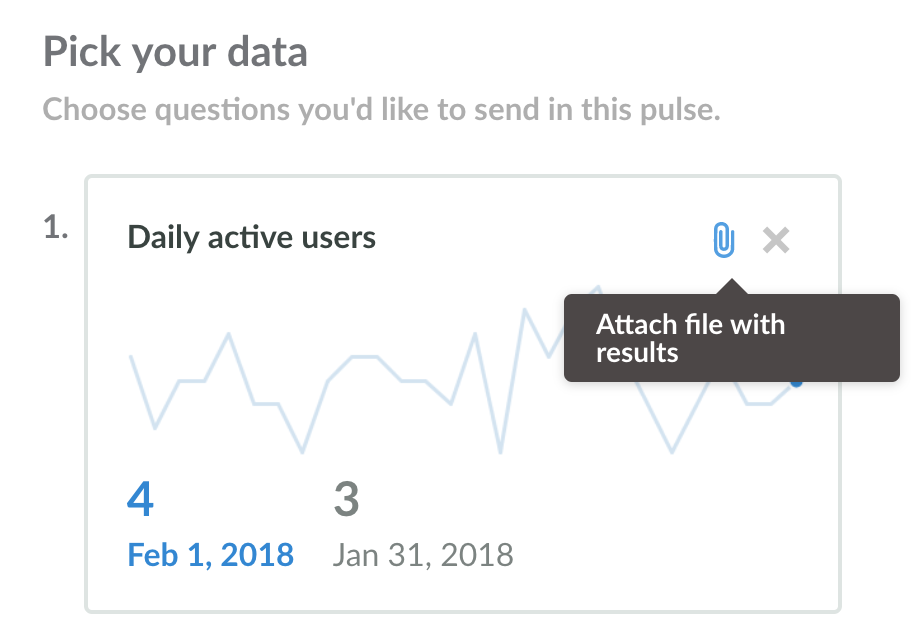
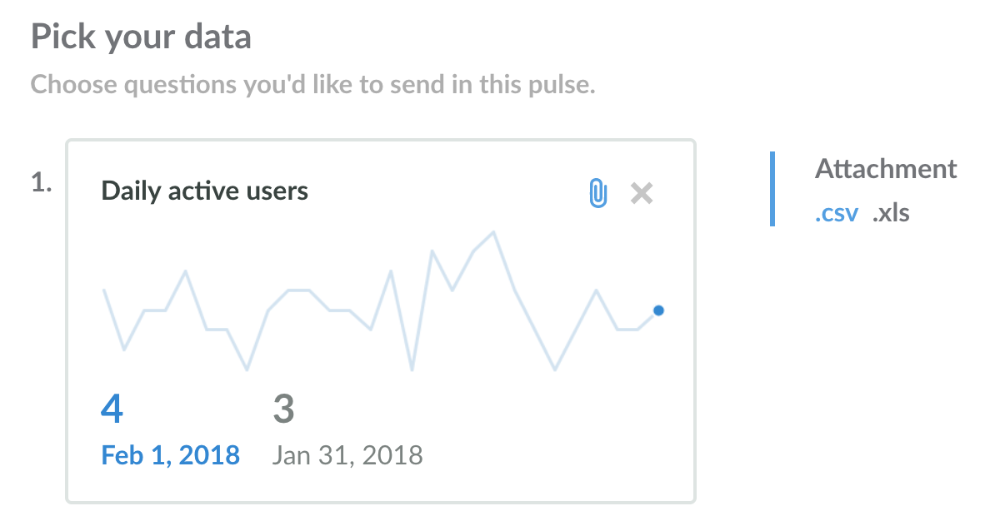
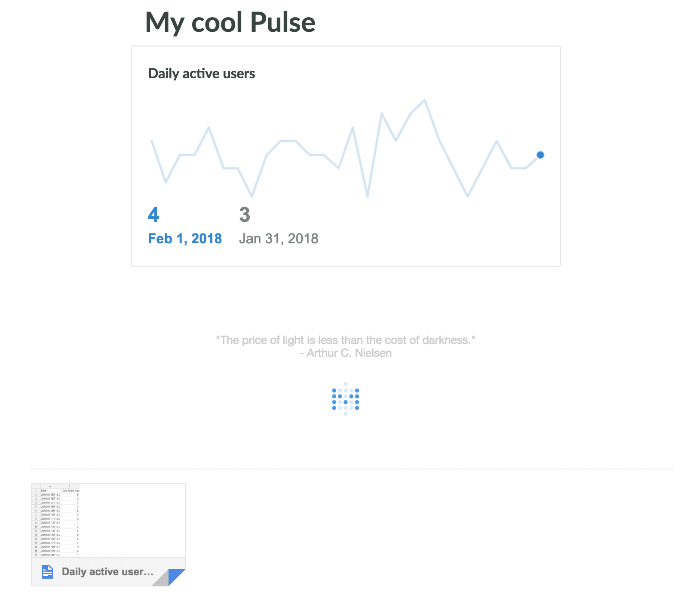
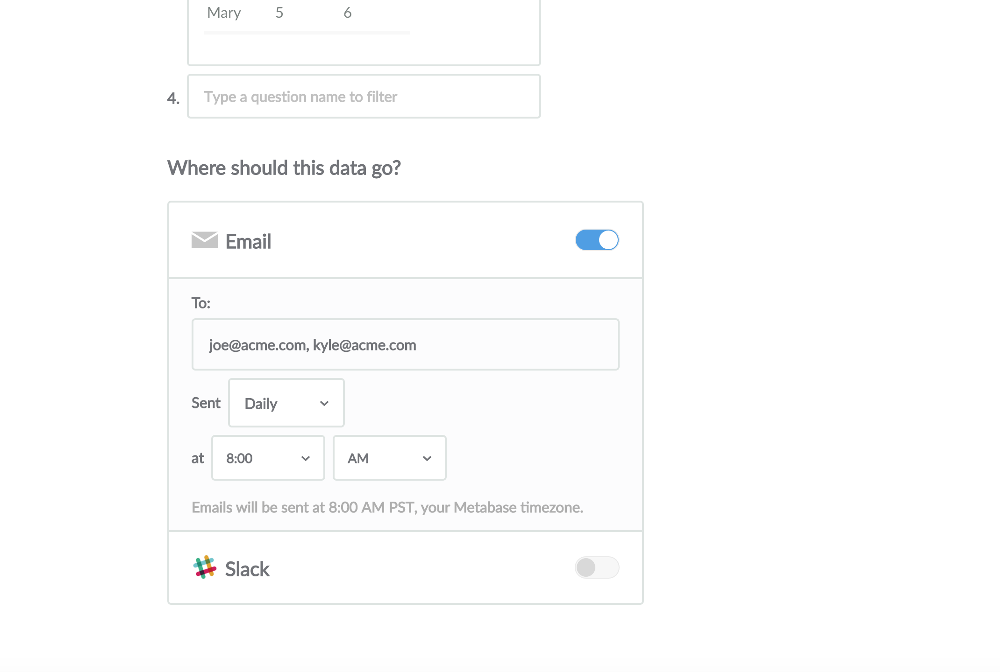

## Sharing updates with pulses
The Pulses feature in Metabase gives you the ability to automatically send regular updates to your teammates to help everyone keep track of changes to the metrics that matter to you most. You can deliver a ulse via email or [Slack](https://slack.com/), on the schedule of your choice.

Click the `Pulses` link in the top menu to view all of your pulses, and click `Create a pulse` to make a new one.

### Name it
First, choose a name for your pulse. This will show up in the email subject line and the Slack message title, so choose something that will let people know what kind of updates the pulse will contain, like “Daily Marketing Update,” or “Users Metrics.”

### Pick your data
Before you can create a pulse, you’ll need to have some [saved questions](06-sharing-answers.md). Click the dropdown to see a list of all your saved questions. You can type in the dropdown to help filter and find the question you’re looking for.

When you select a saved question, Metabase will show you a preview of how it’ll look in the pulse. Because of the space constraints of email and Slack, Metabase will automatically make some adjustments to the appearance of your saved question so that it looks great in the pulse. For example, in order to save space, pie charts will automatically be transformed into bar charts.

As of Metabase 0.29, you can now include tables in your pulses. They'll be capped to 10 columns and 20 rows, and for emailed pulses the rest of the results will be included automatically as a file attachment, with a limit of 2,000 rows.

#### Attaching a .csv or .xls with results
You can also optionally include the results of a saved question in an emailed pulse as a .csv or .xls file attachment. Just click the paperclip icon on an included saved question to add the attachment. Click the paperclip again to remove the attachment.

Choose between a .csv or .xls file by clicking on the text buttons:

Your attachments will be included in your emailed pulse just like a regular email attachment:

#### Limitations
Currently, there are a few restrictions on what kinds of saved questions you can put into a pulse:

* Raw data questions are capped to 10 columns and 20 rows. For emailed pulses, the rest of the results will be included automatically as a file attachment, with a limit of 2,000 rows.
* Pivot tables will be cropped to a maximum of three columns and 10 rows.
* Bar charts (and pie charts which get turned into bar charts) will be cropped to one column for the labels, one column for the values, and 10 total rows.

### Choose how and when to deliver your data
Each pulse you create can be delivered by email, Slack, or both. You can also set a different delivery schedule for email versus Slack. To deliver by email, just type in the Metabase user names, or email addresses you want to send the pulse to, separated by commas. Then, choose to either send it daily, weekly, or monthly, and the time at which you want it to be sent.

To send via Slack, you’ll need to choose which channel you want to post the pulse in, whether you want it to post hourly or daily, and at what time. Again, the schedule for Slack can be different from the schedule for email.

Once you’re done, just click `Create pulse`. You’ll see your new pulse, along with its recipients, and the saved questions that are included in the pulse. If anyone else on your team wants to subscribe to a pulse that’s delivered by email, they can click the button that says `Get this email` from the Pulses screen.

### Editing and Deleting a Pulse
If you ever need to make changes to a pulse, just hover over the pulse from the list and click the `edit` button that appears.

If you want to delete a pulse, you can find that option at the bottom of the edit screen. Just remember: if you delete a pulse, no one will receive it anymore.

---

## Next: Connecting Metabase to Slack with Metabot 🤖

If your team uses Slack to communicate, you can [use Metabot](11-metabot.md) to display your saved questions directly within Slack whenever you want.
